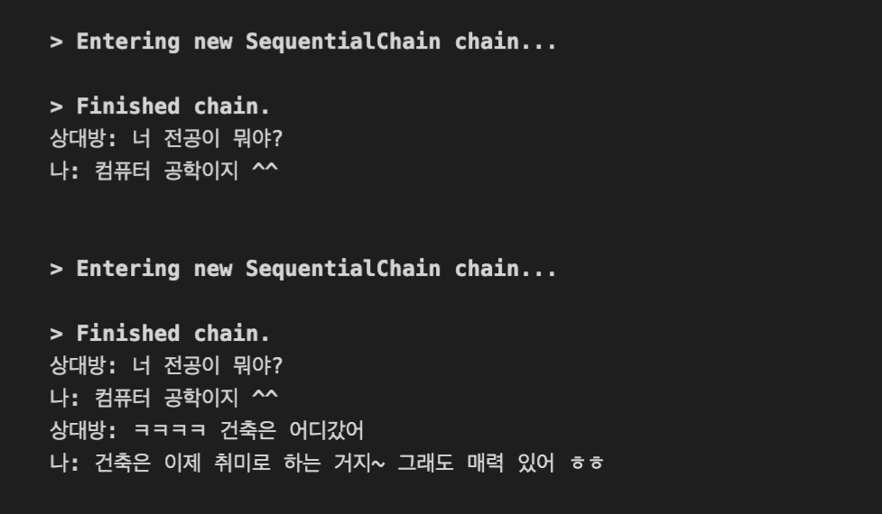

# DoppelgangerGPT

This GitHub repository uses OpenAI API, vector search, and langchain to create a personalized digital doppelganger that mimics your language and communication style. Doppelganger provides an AI-based chatbot experience that reflects the user's personality based on KakaoTalk chat data.

## Installation

To install the dependencies, run the following command:

```
pip install -r requirements.txt
```

## Environment Variables

Create a .env file in the root folder and add the following line:

```
OPENAI_API_KEY="YOUR_OPENAI_API_KEY"
```

Make sure to replace YOUR_OPENAI_API_KEY with your actual OpenAI API key.

## Dataset Setup

Export your KakaoTalk chat data and save it as KakaoTalkChats.txt. Then, move the file to the data/kakaotalk_data/ folder.

## Usage

To process the data, run the following commands:

```
cd data/kakaotalk_data
python process_data.py
```

This will create a /db folder in the root directory.

Next, run the following command to start the chatbot:

```
python main.py
```

## Examples

Examples of previous version (The names of the people talking were set to "상대방" and "나")



- [ ] currently preparing a GIF

## Licence

- [ ] currently writing a Licence
